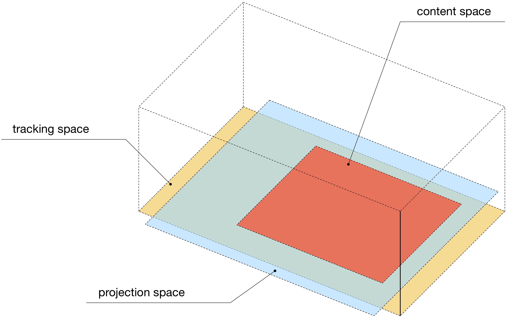

# OPT and OM helper TOXes

This is a collection of useful TOXes for OPT_CHOP and OM_CHOP. 

* **base_opt_receiver.tox**

    OSC receiver of OPT data (sent by **base_opt_sender.tox**).

* **base_opt_sender.tox**

    OSC forwarder of OPT data.

* **cluster_vizualizer.tox**

    Trivial cluster vizualizer component for OM_CHOP.

* **containter_opt_visualizer_v1**

    OPT visualizer container (v1).

* **containter_opt_visualizer_v2**

    OPT visualizer container (v2, latest).

* **opt-om-viewpanel.tox**

    A view panel for monitoring and vizualizing OPT and OM data.

# OPT projection set up & calibration

An example project -- [OPT_TEMPLATE.toe](OPT_TEMPLATE.toe) (credits to [elburz](https://github.com/elburz)) shows how to set up and calibrate projection on the floor (or any other surface) using OpenPTrack.

## Introduction

This template helps you work through each step of working with OpenPTrack and TouchDesigner.
It is meant to show you how to align an overhead projector and the data from OpenPTrack so that you can project on and around people inside of an interactive space.
It is also useful to generally align your content to OpenPTrack data for display on other surfaces.

This template project assumes:
- that there is an OpenPTrack system with 4x Kinect 2 cameras create a tracking space on a rectangular dance floor
- that there is one projector mounted above the dance floor that is projecting on the ground.

## Concept

It is important to understand the different conceptually steps of working with OpenPTrack and an overhead projector.

You should visualize the different "spaces" that we are trying to align, which are the projection space, the content space, and the tracking space.
The projection space is the 2D space of your projector's light on a surface.
The content space is the smaller area inside the projection surface that we want to use.

The reason these are separated conceptually is that in many setups, you may not have a direct or perpendicular projection angles, or your projector's lens may projector much more than you would like it to. This means that we should be aware that the content space could actually be smaller than our full projection area.

The final space is the OpenPTrack tracking space which will be a 3D box-like volume.
In most cases the tracking space will probably be bigger than the projection space.

## Step 1 - Prepare your projector and measure content space

The goal of this step to setup your projection space and then to measure your content space.
Before diving into measuring your content space, spend adequate time adjusting your projector.

A little bit of time spent adjusting your projector could save you a lot of headache in later stages.
The ideal situation has the projector projecting perpendicularly at your projection surface (in this template, it is the floor).
Ideally the projector is also keystoned and focused to create as close to a straight image as possible.
If you can't achieve these things, do your best and you can corner pin your content space at a later stage.

The component named 'content_space_measurement' has all the custom parameters you need to get started.
Your goal here is to output a solid colour or wireframe quad onto the projection surface, and then measure the length and width in pixels.

Start by entering the projector resolution and selecting the monitor index of the project.
Click on 'Open Output Window' to open the window.

Use the 'Content Size', 'Content Center', and 'Rotation' parameters to fill the area that you will be creating content for with the solid colour box.
Continue to update the parameters until you have your tracking space sufficiently covered. Then click "Close Window."

## Step 2 - Prepare your OpenPTrack data

The first step in preparing your OpenPTrack data is to measure your tracking space, which is in unit meters.
Start by clearing the floor space of users so that you only have one active user in the tracking space.

Set the duration you'd like to calibrate for in the custom parameters of the 'tracking_space_measurements' component.
Usually it is good to set this to however long it will take to walk back and forth inside the tracking space a few times on the different axis.

When you are ready to calibrate, click the "Activate Calibration" pulse button.
This will deactivate the previous boundaries in the active OpenPTrack CPlusPlus CHOP, measure the distances walked by the user, and then writes the new boundary parameters and activates them.

You can chose to use the coordinates in three different ways on the "OPT" component.
"RAW" is the original coordinates from OpenPTrack which is in unit meters.
"Normalized" is the coordinates normalized to a range of 0-1 (generally recommended).
"Pixel space" remaps the normalized coordinates to match the content space measurements taken in step 1 (Note: the Z/Height channel remains normalized from 0 to 1).

## Step 3 - Making some content

Once you have all the information from the calibration and data preparation, you're ready to make some content.
You can use Select CHOPs to select the final output from the "OPT" component. This will give you your CHOP channels with OPT data.
You can also directly reference the paramters from the different components, to get elements such as:

- content space size
- content space position/rotation
- projector resolution

After that you can use the positions as you wish inside of your content generation area.
